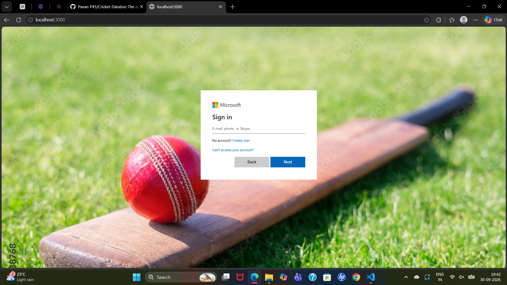
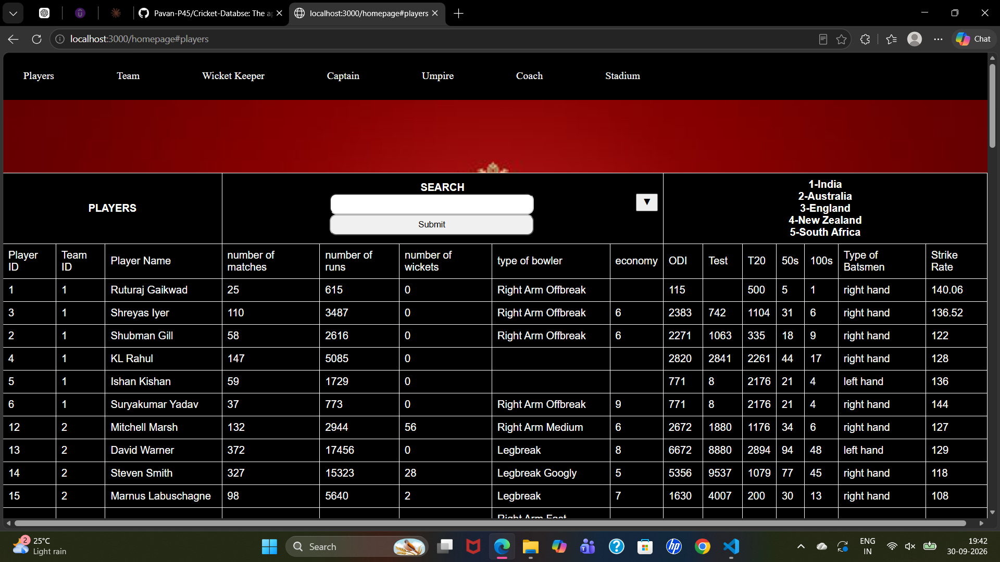
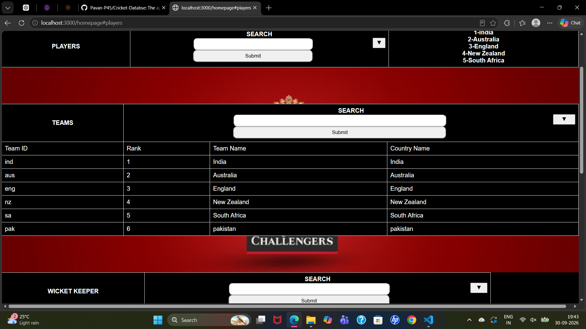
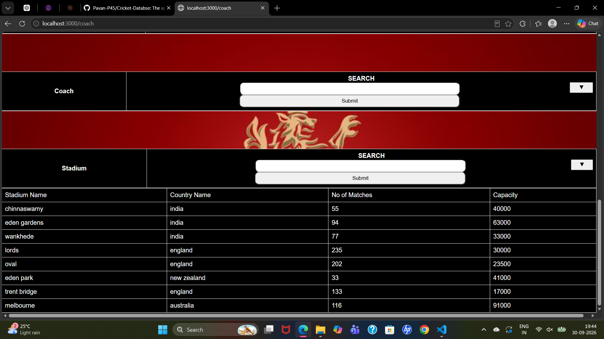
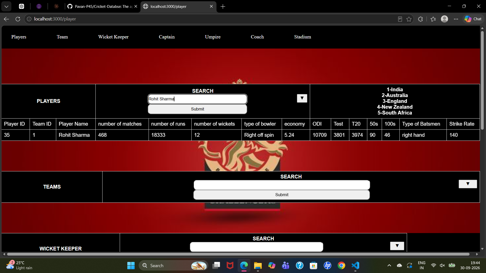

# Cricket Database Web Application

A web application built with **Node.js, Express, EJS, and SQLite** to manage and display cricket-related data.

The application provides information about **players, teams, wicket-keepers, captains, umpires, coaches, and stadiums**. Users can browse the available data and filter information using the search functionality.

## 📸 Application Screenshots

### 🔐 Login Page

The application starts with a login page before accessing the cricket database.



### 🏏 Players

The Players section displays detailed information about cricketers, including matches, runs, wickets, batting type, strike rate, and other statistics.



### 🏆 Teams

The Teams section displays team information including team ID, rank, team name, and country name.



### 👨‍🏫 Coach and Stadium

The application provides information about coaches and stadiums, including stadium name, country, number of matches, and capacity.



### 🔍 Player Search

Users can search for a specific player and view the matching cricket statistics.



## ✨ Features

- View all players
- View teams
- View wicket-keepers
- View captains
- View umpires
- View coaches
- View stadiums
- Search and filter cricket information
- Search players by name
- Search information by team
- Display player statistics
- Display team rankings
- Display stadium information
- Dynamic pages using EJS templates
- Store data using SQLite database

## 🛠️ Technologies Used

- Node.js
- Express.js
- EJS
- SQLite3
- HTML
- CSS
- JavaScript

## 📂 Database

The application uses a SQLite database named:

```text
final.db